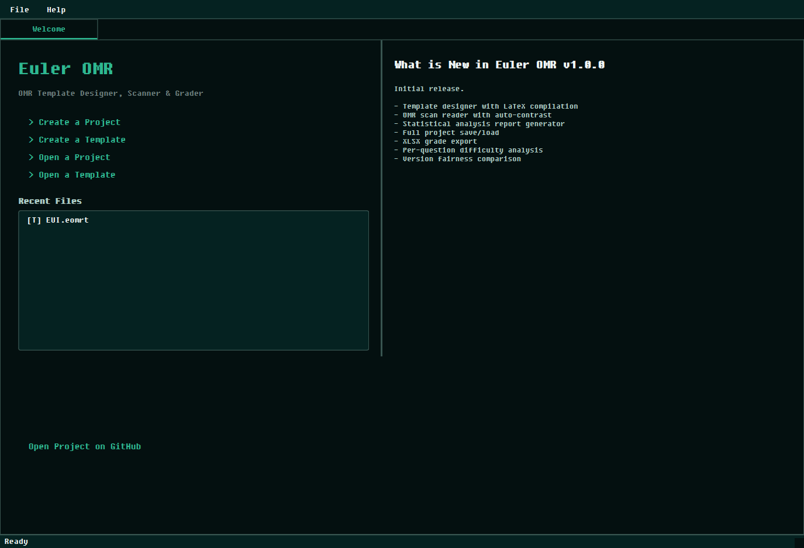
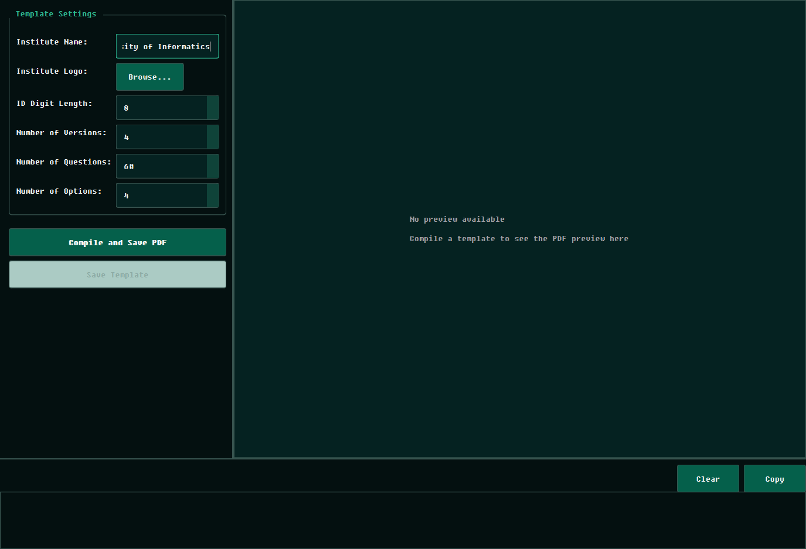
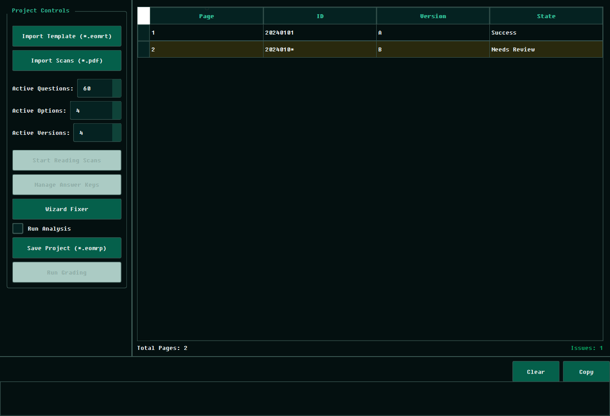
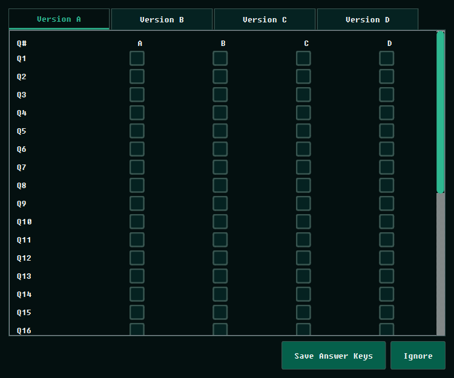

<div align="center">
  

  # Euler OMR

  **Design · Scan · Grade · Analyze**

  A production-grade desktop application for optical mark recognition,<br/>
  automated grading, and institutional psychometric analysis.

  [](https://github.com/MustafaMahmoud-ILE/EulerOMR/releases)
  [](https://opensource.org/licenses/MIT)
  [](https://www.python.org/downloads/)
  [](https://pypi.org/project/PySide6/)

  [**Download Latest Release**](https://github.com/MustafaMahmoud-ILE/EulerOMR/releases/latest) · [Report Bug](.github/ISSUE_TEMPLATE/bug_report.md) · [Request Feature](.github/ISSUE_TEMPLATE/feature_request.md)

</div>

<br/>

## Overview

Euler OMR bridges the gap between basic grading tools and professional psychometric evaluation platforms. It is designed for educational institutions that need **precision**, **transparency**, and **statistical rigor** in their assessment workflows.

With Euler OMR, you can design pixel-perfect OMR answer sheets, scan and read student responses with high accuracy, resolve ambiguities through an intuitive review interface, and generate publication-ready psychometric reports — all from a single application.

<br/>

## Screenshots

| Welcome Dashboard | Template Designer |
|:---:|:---:|
|  |  |

| Project & Grading | Answer Key Management |
|:---:|:---:|
|  |  |

<br/>

## Features

### 📐 Template Designer
Design professional OMR answer sheets with full control over layout parameters:
- Configurable student ID length, exam versions, and question counts
- Custom institutional logos and branding
- One-click LaTeX compilation to publication-ready PDF
- Self-contained `.eomrt` template bundles for easy distribution

### 📠 Scan Processing Engine
High-accuracy optical mark recognition powered by OpenCV:
- Automated corner-mark detection with perspective correction and deskewing
- Threshold-based pixel density analysis for bubble evaluation
- Multi-page PDF batch processing with parallel execution
- Color-coded ambiguity dashboard for manual review of double-marks and faint erasures

### 📊 Psychometric Analytics
Institutional-grade statistical analysis for every exam:

| Metric | Description |
|:---|:---|
| **Cronbach's Alpha** | Internal consistency and reliability coefficient |
| **KR-20** | Kuder-Richardson reliability for dichotomous items |
| **Split-Half Reliability** | Spearman-Brown corrected split-half estimate |
| **Item Difficulty (p-value)** | Proportion of correct responses per question |
| **Discrimination Index (D)** | Upper-lower group discrimination power |
| **Point-Biserial Correlation** | Item-total score correlation coefficient |
| **Distractor Efficiency** | Non-functional distractor identification |
| **ANOVA / Kruskal-Wallis** | Cross-version fairness and equivalence testing |

Results are compiled into a comprehensive, multi-page **LaTeX PDF report** with severity classifications, actionable pedagogical insights, score distributions, and top-student appendices.

### 📦 Project Management
Everything is stored in portable, self-contained file formats:
- **`.eomrt`** — Template bundles (config + compiled PDF + logos)
- **`.eomrp`** — Full project envelopes (template + scans + results + answer keys + analysis)
- Double-click any file to open it directly in a running instance

<br/>

## Installation

### Standalone Release <sub>recommended</sub>

Download the latest installer or portable `.zip` from the [**Releases**](https://github.com/MustafaMahmoud-ILE/EulerOMR/releases/latest) page. No dependencies required — just install and run.

> **Zero-config LaTeX:** Starting with v1.1.5, you no longer need a pre-installed LaTeX distribution.
> When you first compile a template or generate a report, Euler OMR will offer to download and configure
> [TinyTeX](https://yihui.org/tinytex/) automatically with a single click.

### Run from Source

```bash
git clone https://github.com/MustafaMahmoud-ILE/EulerOMR.git
cd EulerOMR
pip install .
python main.py
```

**Requirements:** Python 3.11+ on Windows 10/11.

### Build for Distribution

```bash
python scripts/build_dist.py
```

Produces both a portable `.zip` and a Windows installer (`.exe`) via [PyInstaller](https://pyinstaller.org/) and [Inno Setup](https://jrsoftware.org/isinfo.php).

<br/>

## Tech Stack

| Layer | Technology |
|:---|:---|
| **GUI Framework** | PySide6 (Qt 6) |
| **PDF Engine** | pypdfium2 |
| **Computer Vision** | OpenCV |
| **Typesetting** | LaTeX via PyTinyTeX |
| **Statistics** | SciPy, NumPy |
| **Visualization** | Matplotlib |
| **Spreadsheet Export** | openpyxl |

<br/>

## Changelog

### v1.1.5 — *Latest*
- **Automated LaTeX Pipeline** — One-click TinyTeX setup via PyTinyTeX integration
- **Seamless File Association** — Double-click `.eomrp`/`.eomrt` files to open them in the running instance
- **Windows Taskbar Branding** — Custom AppUserModelID for proper icon pinning
- **Standardized Asset Layout** — Assets placed next to the executable for portable deployments

<br/>

## Contributing

Contributions are welcome! Please read the [Contributing Guidelines](CONTRIBUTING.md) before submitting a pull request.

## License

Distributed under the **MIT License**. See [`LICENSE`](LICENSE) for details.

## Author

**Mustafa Mahmoud** — [mustafa1015104@gmail.com](mailto:mustafa1015104@gmail.com)

<div align="center">
  <sub>Built with precision for academic institutions.</sub>
</div>
