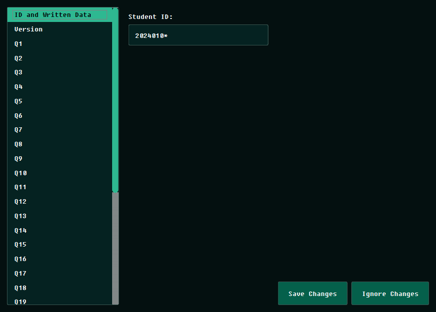

<div align="center">
  
  <h1>Euler OMR</h1>
  <p><strong>A Production-Grade Psychometric Evaluation and Optical Mark Recognition Engine</strong></p>
  
  [](https://opensource.org/licenses/MIT)
  [](https://www.python.org/downloads/)
  [](https://pypi.org/project/PySide6/)
  [](https://github.com/MustafaMahmoud-ILE/EulerOMR/releases)
</div>

<hr/>

Euler OMR is a highly rigorous, academically compliant desktop application designed for institutions. It bridges the gap between basic grading and **professional psychometric analytics**. 

Design precise OMR templates, accurately scan and read student answer sheets, resolve ambiguities effortlessly, and instantly generate publication-ready academic assessment reports.

## 🚀 Key Features

### 📐 Academic Template Designer
- **Dynamic Configuration:** Design OMR sheets with customizable ID lengths, multiple exam versions, and flexible question/option configurations.
- **LaTeX Compilation:** Instantly compile publication-ready PDF templates utilizing `pdflatex`.

### 📠 Robust Scan Processing
- **Automated Corner Detection:** Utilizes OpenCV algorithms to automatically align and deskew scanned PDFs.
- **Intelligent Bubble Analysis:** Evaluates student ID, exam version, and selected answers through threshold-based pixel density analysis.
- **Ambiguity Resolution:** A dedicated, color-coded Review Dashboard allows operators to manually resolve double-marked or faintly erased bubbles with real-time visual crops.

### 📊 Institutional Psychometric Analytics Engine
- **Reliability Metrics:** Mathematically rigorous evaluation using Cronbach's Alpha, KR-20, and Split-Half Reliability calculations to ensure exam consistency.
- **Advanced Item Analysis:** Automated calculation of p-values (Difficulty), Point-Biserial Correlations, Discrimination Indices (D), and Distractor Efficiency.
- **Version Equivalence:** Statistically evaluates the fairness between different exam versions using ANOVA or Kruskal-Wallis tests.
- **Executive Dashboard:** Generates a comprehensive, multi-page LaTeX PDF report complete with severity classifications, actionable pedagogical insights, and top-student appendices.

---

## 📸 Interface Previews

| Welcome Dashboard | Template Designer |
|:---:|:---:|
|  |  |

| Automated Grading & Review | Answer Key Management |
|:---:|:---:|
|  |  |

---

## 💻 Installation & Setup

### Option 1: Standalone Release (Recommended)
Download the latest production release from the [Releases](https://github.com/MustafaMahmoud-ILE/EulerOMR/releases) page. 

**Zero-Config Experience:**
Starting with **v1.1.5**, you no longer need to pre-install LaTeX. When you first attempt to compile a template or generate a report, Euler OMR will offer to automatically download and configure a minimal LaTeX environment (**TinyTeX**) for you with a single click.

### Option 2: Run from Source
```bash
# Clone the repository
git clone https://github.com/MustafaMahmoud-ILE/EulerOMR.git
cd EulerOMR

# Install dependencies
pip install .

# Run the application
python main.py
```

## 🏗️ Building for Production
You can compile your own standalone executable and Windows Installer using the included automated build script:
```bash
python scripts/build_dist.py
```
This requires **PyInstaller** and **Inno Setup** (for the `.exe` installer) to be present on your system.

---

## 🌟 What's New in v1.1.5
- **Automated LaTeX Pipeline:** Integration with `PyTinyTeX` for one-click environment setup.
- **Enhanced Taskbar Integration:** Full support for Windows taskbar pinning and custom branding.
- **Seamless File Association:** Double-clicking `.eomrp` or `.eomrt` files now forwards them to the active application instance.
- **Improved PDF Engine:** Transitioned to `pypdfium2` for faster and more accurate template previews.

---

## 📂 System Architecture & Formats

Euler OMR utilizes a clean, stateless configuration approach through embedded base64 architectures:
- **`.eomrt` (Euler OMR Template):** A self-contained JSON bundle holding the template configuration, the compiled LaTeX PDF, and embedded institutional logos.
- **`.eomrp` (Euler OMR Project):** A comprehensive project envelope containing the embedded template, imported scans, read results, answer keys, and psychometric profiles.

## 📄 License
This project is open-source and licensed under the **MIT License**.
